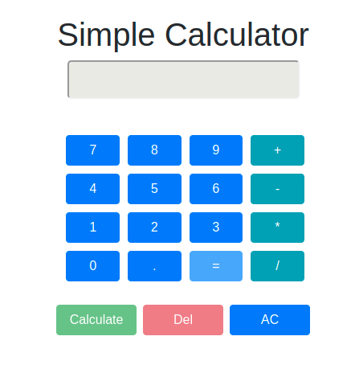

## SimpleCalculator
This is Full Stack implementation for simple calculator

## Technologies
* Spring Boot
* React

## Simple calculator
 

## Simple calculator options
* Only one mathematical operation can be resolved
* Mathematical operators: +,-,*,/
* Calculator can resolve mathematical expressions like:
  * 3+4
  * 3*6
  * -4*-3
  * 3/-4
  * 3-9
  * -3+4
  * 3+-6
* Calculator can't resolve mathematical expressions with multiple calculations like:
  * 3+4+7
  * 4+5+7*3-4
  * 3/3+3*-5-7*9
 
 
